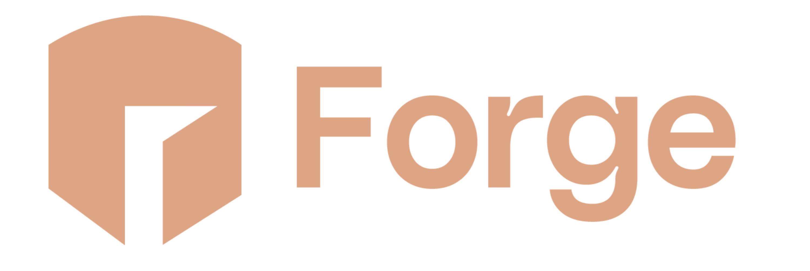
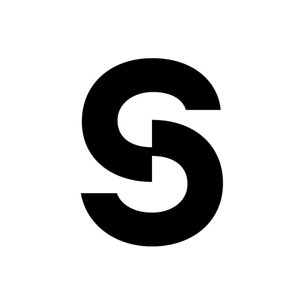

<br>

<p align="center">
  
</p>
<br>

<p align="center">
   <a href="https://github.com/0xZeroLabs/the-forge/network/members"></a>
   
   <a href="https://x.com/0xZeroOrg"></a>
   <br>
   <!--  -->
   <a href="https://github.com/0xZeroLabs/the-forge/issues"></a>
   <a href="https://github.com/0xZeroLabs/the-forge/pulls"></a>
   <a href="https://github.com/0xZeroLabs/the-forge/graphs/contributors"></a>
   <!--  -->
<br>
  <a href="https://docs.0xzero.org"></a>
  <a href="https://github.com/0xZeroLabs/the-forge/blob/master/LICENSE"></a>
</p>

# The Forge ⚒

The Forge is an AVS built on [EigenLayer](https://eigenlayer.xyz) through the [Othentic](https://othentic.xyz) stack, designed to verifiably register web2 data as IP on Story Protocol unleashing access to infinite IP.

# 🎯 Grand Plan

We're currently focused on achieving the following to get a working version of The Forge:

- [x] Story Protocol IP smart contracts
- [x] IP registration in execution registrar via Alloy
- [x] Transcript verification
- [x] Metadata schema system (instructs registrar)
- [x] AVS validation service

The following is currently on our roadmap but has a few technical overhead.

- [ ] Prover with zkVM (Transcript verifier)
- [ ] Attestation service ZKP verification
- [ ] Onchain registry for tracking INGOTs (IPs) ...

# ⚙️ Set Up

## ✈️ Install the Othentic CLI

Installing Othentic CLI with `npm`:

```sh
npm i -g @othentic/othentic-cli
```

Verify installation by the command:

```sh
othentic-cli -h
```

## 🧰 Prerequisites

You need to register as an Operator with a minimum of about 0.01 stETH (unverified).

## 🏋️‍♂️ Operator Setup

Register as an operator for both EigenLayer and the AVS

```sh
othentic-cli operator register
```

## 🔁 Convert ETH into stETH [Optional]

This command converts 0.012 ETH into stETH before depositing it into EigenLayer pool:

```sh
othentic-cli operator deposit --strategy stETH --shares 0.01 --convert 0.012
```

Activate your Operator by depositing into EigenLayer
Deposit 0.01 stETH into EigenLayer pool.

```sh
othentic-cli operator deposit --strategy stETH --shares 0.01
```

✅ Your internal Operators are now ready to opt-in to our AVS.

## ▶️ Run the node

We'll be providing a docker file which will run the execution service and the attester nodes. To run the node, run:

```sh
docker run --init -p 127.0.0.1:2077:2077 ghcr.io/0xzerolabs/the-forge/execution:latest
```

> [!NOTE]
> There's currently no image for the AVS as it's still in development.

## 🚀 Checking the health status of your AVS node

To check the health of the AVS node, we can send a GET request to the node endpoint:

```sh
curl -X GET <http://localhost:2077/health>
```

You should receive a response with a status code of 200 and a message of "OK".

✅ Your AVS node is now functional and part of The Forge!

# 🏗️ Built with

- AVS: EigenLayer, Othentic
- Logic: TLSN, Rust, SP1
- Data: EigenDA, Irys
- Infra: Docker, Sindri

**This project is made possible with the tech and engineering efforts of the following organisations:**

<p align="left">
    <a href="https://eigenlayer.xyz" target="_blank"> </a>
    <a href="https://othentic.xyz" target="_blank"> </a>
    <a href="https://story.foundation" target="_blank"> </a>
    <a href="https://0xzero.org" target="_blank"> </a>
</p>
