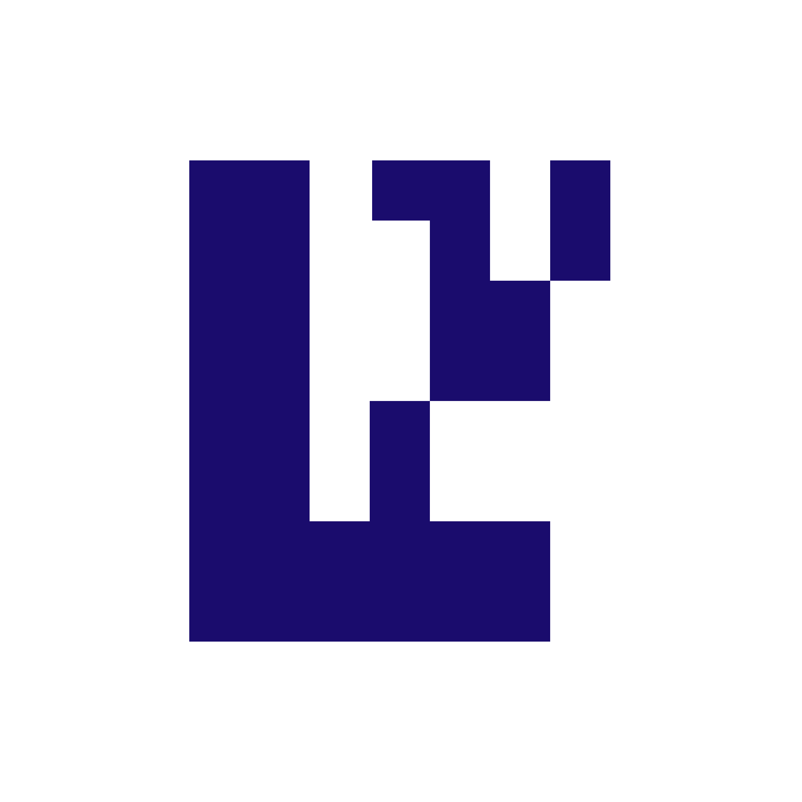

 

  

 

   
   
   
    
   <!--  -->
   
   
   
   <!--  -->
 
  
  

# The Forge ⚒

The Forge is an AVS built on [EigenLayer](https://eigenlayer.xyz) through the [Othentic](https://othentic.xyz) stack, designed to verifiably register web2 data as IP on Story Protocol unleashing access to siloed IP.

# 🎯 Grand Plan

We're currently focused on achieving the following to get a working version of The Forge:

- [x] Story Protocol IP smart contracts
- [x] IP registration in execution registrar via Alloy
- [x] Transcript verification
- [x] Metadata schema system (instructs registrar)
- [x] AVS validation service

The following is currently on our roadmap but has a few technical overhead.

- [ ] Set up metrics and monitoring
- [ ] Prover with zkVM (Transcript verifier)
- [ ] Attestation service ZKP verification
- [ ] Onchain registry for tracking INGOTs (IPs) ...

# ⚙️ Operators

In order to become an operator, check out our [operators' guide](https://forge.0xzero.org/operators).

# 🏗️ Built with

- AVS: EigenLayer, Othentic
- Logic: TLSN, Rust, SP1, Sindri
- Data: EigenDA, Irys

<strong style="display: block;" align="center">This project is made possible thanks to the tech and engineering efforts of the following organisations:</strong>

    
    
    
    

